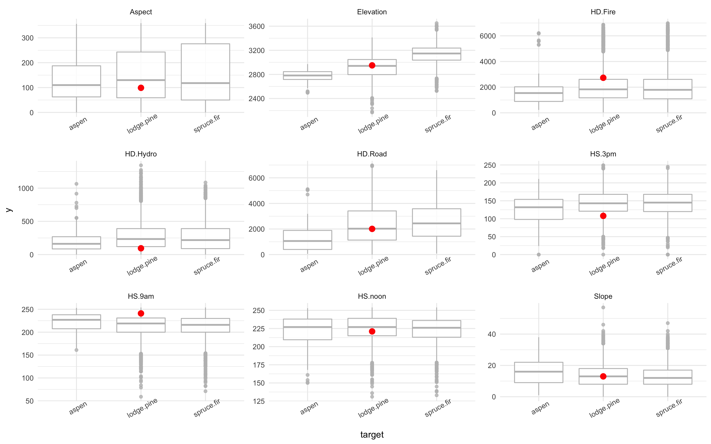

```{r setup, include=FALSE}
options(htmltools.dir.version = FALSE)
library(highlight)
library(DT)
```
background-image: url(images/lime-fruit.jpeg)
background-position: 90% 50%
background-size: 50% 50%
class: left, top

<br>

### What is ML Interpretability ?

### Why ML Interpretability ? 

### What is LIME ?

### Lets see it in action!

### Is it useful? 

### Further Resources 

---

# What is ML Interpretability ?

- for a data scientist.. 


---
### Interpretablity vs .Complexity


---
### ML Interpretability Goal

- create technique to produce more explainable models, while maintaining high level of performance

- present textual or visual artifacts

- the data **product** augments the data **consumers** prior knowledge


---
# Why ML Interpretability


---
background-image: url(images/all-legal.jpeg)
background-position: 100% 80%
background-size: 100% 70%

# Legal Requirements

---
background-image: url(images/headlines.jpg)
background-size: 100% 100%


---
# Interpretablity for a DS


<br><br><br><br><br><br><br><br><br><br><br>

- bias or leakage

- data shift/drift

- interactive machine learning (data debuggers!) 


---
class: inverse

# What is LIME ?

#### "Why should I trust you"
##### Explaining the predictions of any classifier

- Marco Tulio Rubiero, Sameer Singh, Carlos Guestrin

### LIME

- Local 

- Interpretable

- Model-Agnostic

- Explanation

<br><br>

- $\xi(x) = \underset{g\in G}{\operatorname{argmax}} \ell(f, g, \pi_x) + \Omega(g)$


---

### What is LIME


**GENERATE DATASET**

- the perturbed data sample are weighted by their proximity to the original instance under observation. 

- in this way the LIME representation is said to be "locally faithfulyy" - in that the seperator is correct in the immediate vincinity of the example under observation.

- and an important point to note here is that for the generate the datdaset, the the complex modelis considered the oracle. It is the ground truth for the labels, that go into the linear separator. 


---
background-image: url(images/lime-long.jpg)
background-position: 50% 0%
background-size: 80% 22%

<br><br><br>

.pull-left[

### Perturbed Data
- Numerical
  - sample from Normal(0,1)
  - inverse centering/scaling to mean and std of train data.

- Categorical
  - sample by train distribution


  ]
  
.pull-right[ 
### Linear Model
- highest weights
- forward-selection
- L1-regularization

### Fitted To
- perturbed sample
  - weighted be Euclidean distance

### Discretizer
- transforms continous data
  - quantile, decile, entropy


]

---
# Lets see in action

The Forest Data Set:

.pull-left[
**Variables**
<font size="2">
<ul> Elevatation (elevation in meters) </ul>
<ul> Aspect (direction of slope in degrees azimuth) </ul>
<ul> Slope (slope in degrees) </ul>
<ul> HD.Hydro (horz. dist to nearest surface water) </ul>
<ul> VD.Hydro (vert. dist to water) </ul>
<ul> HD.Road (horz. dist to nearest roadway) </ul> 
<ul> HD.Fire (horz. dist to nearest wildfire ignition points) </ul>
<ul> HS.9am ((0 to 255 index): Hillshade index at 9am, summer solstice. Lower = brighter) </ul>
<ul> HS.noon </ul>
<ul> HS.3pm  </ul>
<ul> <i>(Wilderness Area, Soil Type, Geological Zone) </i> categorical, omitted. </ul>
</font>
]

.pull-right[
**Target**

<font size="2">
<ul> Cover Type (7 types of trees) </ul>
<ul> lodge.pine (48%),  spruce.fir (37%),  ponder.pine (6%),  krummholz(3%),  others(< 3%)</ul>
<ul> 581,012 instances (sampled 10,000) </ul>
</font>
]

---

# Lime Code

- Lime is available for [Python](https://github.com/marcotcr/lime) and more recently Thomas Lin Pedersen has implemented in [R](https://github.com/thomasp85/lime).

```{r install, eval=F}
pip install lime
devtools::install_github("thomasp85/lime")
```

#### Python Implementation

```{python lime.pyton, eval = F,  collapse = T}
import lime
import lime.lime_tabular

explainer = lime.lime_tabular.LimeTabularExplainer(train,
   feature_names= names(train.X), 
   class_names= train.y, discretize_continuous=True)
   
i = np.random.randint(0, test.X[0])
exp = explainer.explain_instance(test.X[i], model.predict_proba, 
      num_features=2, top_labels=1)

#In a Jupyter Notebook
exp.show_in_notebook(show_table=True, show_all=False)
```

---

#### R Implementation

```{r lime.r, eval = F,  collapse = T}
library(lime)

explainer <- lime(train.data, tuned.model , 
                  bin_continuous = TRUE, 
                  n_bins = 4, n_permutations = 1000)

#Grab 1 or more examples to explain
test.example <- sample_n(test.data, 1)

explained.example <- explainer(test.example, 
                               n_labels = 2, n_features = 5, feature_select = "auto")
plot_features(expalined.exampled, ncol = 2)
```

<font size="3">

LIME works with all models that have prediction probabilities. (R, models that work with <mark>predict(type = "prob")</mark> , Python models that have <mark>predict_proba()</mark> method). 


<ul> <span style="color: red; background-color: yellow">bin_countinous</span> should continous features be binned. Default is 4 bins. </ul>

<ul> <span style="color: red; background-color: yellow">n_permutations</span> the number of permutations to generate for each row to be expalined.</ul>

<ul><span style="color: red; background-color: yellow">n_labels</span> how many labels in the target? Do you want to see all probabilites </ul>

<ul>  <span style="color: red; background-color: yellow">n_features</span> How many features to use in the explanatory function? </ul>

<ul>  <span style="color: red; background-color: yellow">feature_select</span> Default is <i>auto</i>. If <span style="color: red; background-color: yellow">n_features <= 6</span> uses <i>forward selection</i>. Can also specify <b>feature_select</b> = c("forward_selection", "highest_weights", "lasso_path")</ul>

</font>

---
class: top
background-image: url(images/lime-output2/explain-output.png)
background-size: 100% 40%
background-position: 100% 50%

#### LIME Output (R)


```{r explain.out, echo =F}
#setwd("~/Desktop/github/lime-exploration/")
#pres.data.file <- "lime-presentation-jun17/images/lime-output2/explain-output.csv"
setwd("~/Documents/Projects/learning/lime-exploration/")
pres.data.file <- "lime-presentation-jun17/images/lime-output2/explain-output.csv"


explain.out <- read.csv(pres.data.file)
explain.out
```


<br><br><br><br><br><br><br><br><br><br>

<font size="3">

<ul> <i>Cover Type</i> has been correctly predicted to be <b>Lodgepole Pine</b></ul>

<ul> Elevation = 2950 is between 2810 & 3001. From permutated data, this supports this class.</ul>

<ul> HD Hyrdo = 95. This does not support the true class. It is more associated with class <b> Spruce Fir </b></ul>

---
class: top, middle
background-image: url(images/lime-output2/explain-output.png)
background-size: 100% 30%
background-position: 100% 0%

<br><br><br><br><br><br><br>



---
### Recap - How does LIME Work?


---
background-image: url(images/lime-output2/xgb-wrong-models.png)
background-size: 100% 80%
background-position: 50% 80%

### Compare Models - XGB Wrong


---
class: inverse
# Is it useful?


###  Review the Claims 

- <p> Explainable Predictions &#10004;<br>

- <p> Practicable benefits &#10004;<br>

- <p> Increase Trust in a model  &#10068;<br>

- <p> Evauluate a model before deploying to <i>real world</i>  &#10004;<br>

- <p> Identify data drift  &#10068;<br>

There is an additional component to the LIME paper **SP LIME** (submodular pick) not discussed here. 

The aim of **SP LIME** is to pick a subset of instances that cover the most important compenents of a model and avoid selecting instances with similar explanations. 


---
### exploration phase 


.footnote[https://github.com/stephlocke/datasauRus, Alberto Cairo

https://en.wikipedia.org/wiki/Anscombe%27s_quartet, Francis Anscombe]


---
### Feature Engineering


<br><br><br><br><br><br><br><br><br><br><br><br><br>


...some machine learning project succeed and some fail. What makes the difference? Easily the most important factor is the features used.
  - Pedro Domingos, <i>A Few Usefule things to Know about Machine Learning</i>


---


<br><br><br>

<font size="2">

https://github.com/iBrianCarter/lime-exploration

##### SlideDecks, Videos & Talks
- [Demystifying Machine Learning using LIME](https://www.slideshare.net/albahnsen/demystifying-machine-learning-using-lime) - 
Alejandro Correa Bahnsen
- [Interpretable Machine Learning](https://www.youtube.com/watch?v=u9UUWqVquXo) - Patrick Hall, H2o.
- [Data Skeptic](https://dataskeptic.com/blog/episodes/2016/trusting-machine-learning-models-with-lime) - Marco Tulio Ribeiro, author of LIME.

##### Articles

- [Interpreting Machine Learning](https://www.oreilly.com/ideas/ideas-on-interpreting-machine-learning) - Patrick Hall, Wen Phan, SriSatish Ambati, H2o.
- [THe Financial World Wants to Open Black Boxes](https://www.technologyreview.com/s/604122/the-financial-world-wants-to-open-ais-black-boxes/?imm_mid=0f134c&cmp=em-na-na-na-newsltr_fintech_20170501) - Will Knight, MIT
- [The Dark Secret at the Heart of AI](https://www.technologyreview.com/s/604087/the-dark-secret-at-the-heart-of-ai/) - Will Knight, MIT
- [DARPA Working on Making AI more Trustworthy](https://futurism.com/darpa-working-make-ai-more-trustworthy/)

##### Code Examples

- Python
  - [Examples from Marco Tulio Riberio](https://github.com/marcotcr/lime/tree/master/doc/notebooks)
  - [Demystifying Maching Learning - Jupyter Notebook](http://nbviewer.jupyter.org/github/albahnsen/Talk_Demystifying_Machine_Learning/blob/master/Demystifying_Machine_Learning_using_LIME.ipynb)
- R
  - [LIME R package](https://github.com/thomasp85/lime)
  - [Explaining complex machine learning models with LIME](https://shiring.github.io/machine_learning/2017/04/23/lime)
  - [LIME with Shiny](https://github.com/merrillrudd/LIME_shiny)
  
##### Other Approaches

- [FairML](http://blog.fastforwardlabs.com/2017/03/09/fairml-auditing-black-box-predictive-models.html) - Julius Adebayo, uses perturbation like LIME. 
- [Explainable Artificial Intelligence,XAI](http://www.darpa.mil/program/explainable-artificial-intelligence) - David Gunning, DARPA. Comprehensive review of active research.
- [NeuroDecision™](https://www.youtube.com/watch?v=SitMy5oeN_A) - commerical application. Excellent video for explaining ML to lay person.

##### Conferences

---
background-image: url(images/whi.png)
background-size: 100% 100%

---
class: center, middle, inverse
background-image: url(images/unicorn.jpeg)
background-size: 30% 30%

## Thank you for your attention
<br><br><br><br><br><br><br><br><br><br><br><br><br><br>
### Any Questions ?

