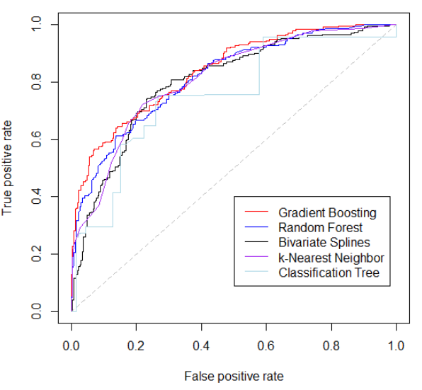
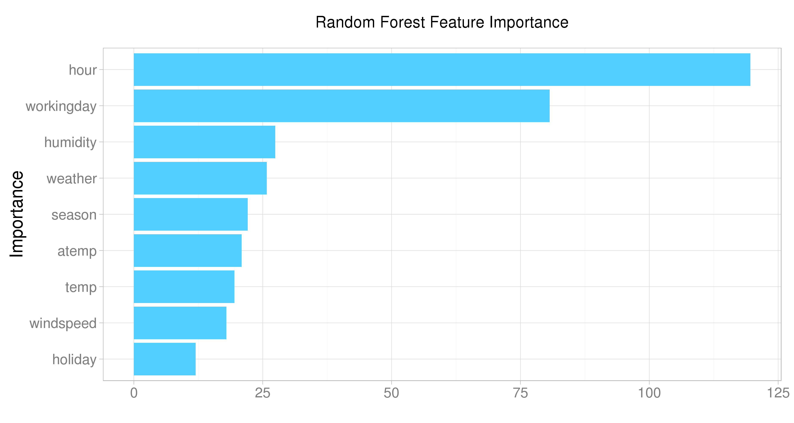
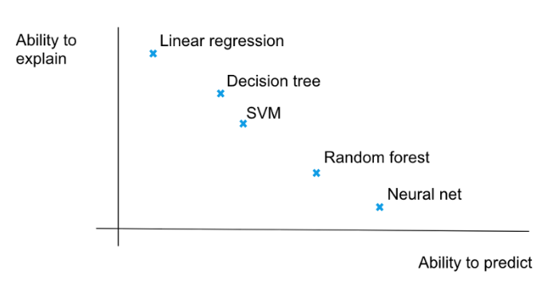
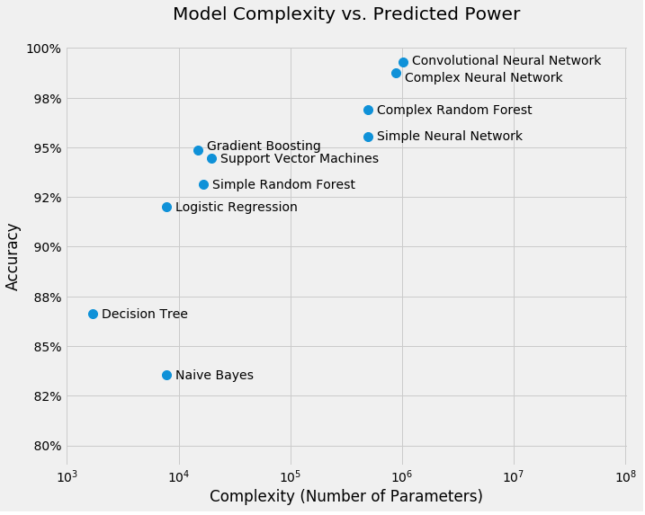
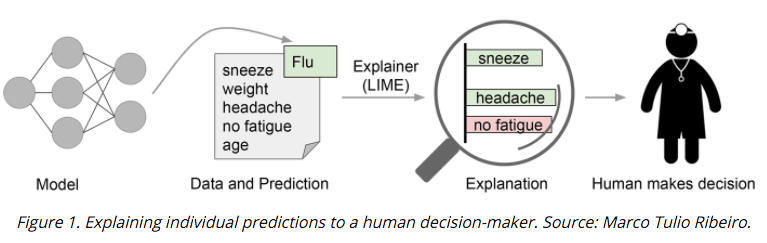
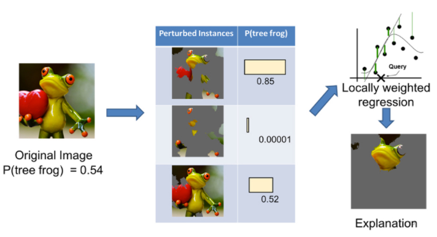
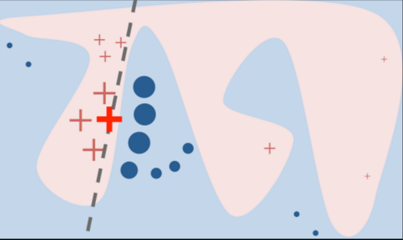
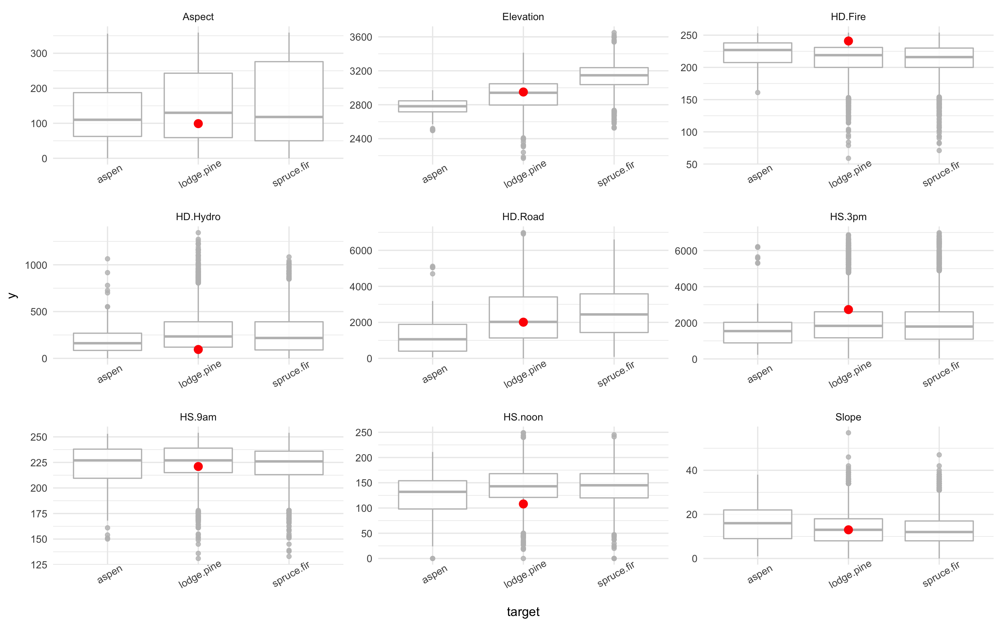
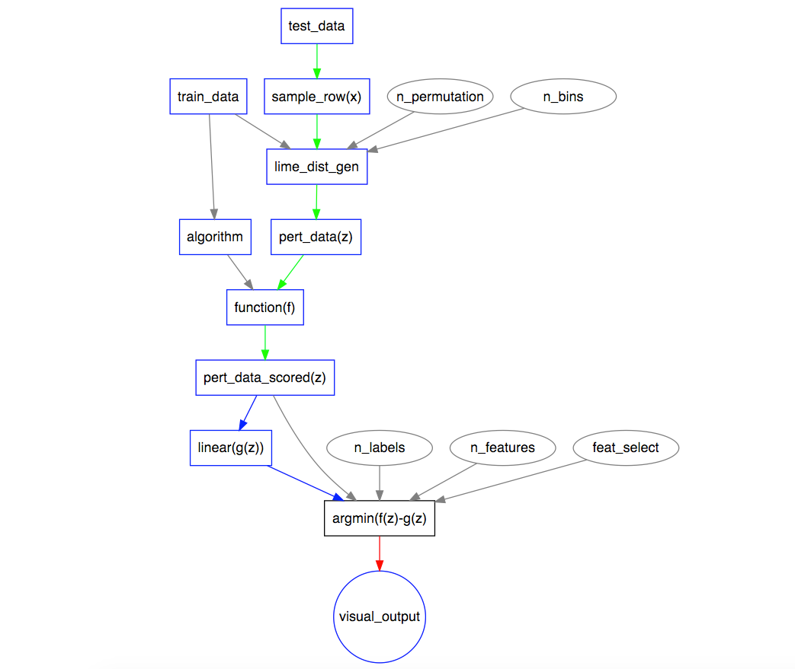
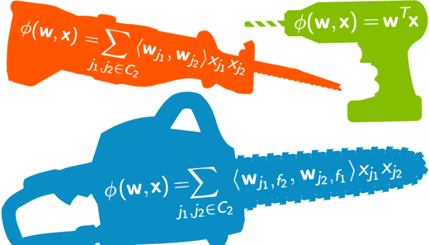

```{r setup, include=FALSE}
options(htmltools.dir.version = FALSE)
library(highlight)
library(DT)
```
background-image: url(images/lime-fruit.jpeg)
background-position: 90% 50%
background-size: 50% 50%
class: left, top

<br>

### What is ML Interpretability ?

### Why ML Interpretability ? 

### What is LIME ?

### Lets see it in action!

### Is it useful? 

### Further Resources 

???
- p opens presenter mode.
- c will clone the slideshow in a separate tab for your viewers.

- First of all thank you to Dominic for organising this session. 

- Todays talk is about Machine Interprability and LIME

- Quicly explain the context of ML Interpretablity, why you might want to use it, or indeed why you might need to use it.

- Talk about the LIME technique and how it works. 

- Going to show you some examples that I have created and how might go about evaulating it. 

- Finally going to go over some of the claims that are made in the LIME paper and 
my opinon as to some of benefits and pitalls.  
---

# What is ML Interpretability ?

- for a data scientist.. 





???

- For a data scientist machine interpretabilty can often look something like this, on the left comparing different binary models with an ROC curve or the right look at a models feature importance.  

- Models are evaluating using various accuracy metrics and typical on validataion dataset. 

- Data scientist often go into a cycle of tweeking input space, hyperparameters  and selecting a model from a number of alternatives.

- From data product point of view - sometimes the evaluation metric of the model align with the goal 

- story here ??? 

- then question is there truly alignment between the metrics that we can compute and optimize (e.g. accuracy) and the actual metrics of interest such as user engagement and retention. 

---
### Interpretablity vs .Complexity




???

(Points from Intelligible Models for HealthCare: Predicting Pneumonia Risk and Hospital 30-day Readmission, Microsoft)

- In machine learing there is sometimes a tradeoff between accuracy and intelligibility. 

- a convulational neural net can have millions of hyperparameters. The dreaded black box of black boxes. 

- in general more accurate models such as boosted trees, random forests, and neural nets usually are not intelligible /  interpretable 

- the more interpretable  models such as logistic regression, naive-Bayes, and single decision trees often have significantly worse accuracy. 

- but even a logistic regressions with many coefficents is difficult to interpret.

- This tradeoff sometimes limits the accuracy of models that can be applied in mission-critical applications where being able to understand, validate, edit a model output is important. 

- right graph minst dataset

---
### ML Interpretability Goal

- create technique to produce more explainable models, while maintaining high level of performance

- present textual or visual artifacts

- the data **product** augments the data **consumers** prior knowledge


???

- slide for XAI program DARPA

- a interpretablity ML model will  present textual or visual artifacts that provide qualitative understanding of the relationship between individual instances and the models prediction

- Humans usually have prior knowledge about the application domain, which they can use to accept (trust) or reject a prediction if they understand the reasoning behind it. 

---
# Why ML Interpretability




???

- in many machine learning data products, a user is being asked to interact with the outputs of a model to help them make a decision. 

- there are high stake situations, a doctor will not take an action, just because "the model said so"

- in the mid 90s, a large multi-institutional project between various universities and hospitals was created to evaluate the application of machine learning to important problems in healthcare;

- one of these being probability of death (POD) for patients with pneumonia

- the goal being high-risk patients could be admitted
- low-risk patients were treated as outpatients. 

- the most accurate models were neural nets, outperforming other methods by a wide margin  (nn AUC=0.86, 0.77 logistic regression),

- although the neural nets were more accurate they were considered too risky for use on real patients. 

- Why ? 

- one of the alternate models was a Rule Base and had learnt the rule that patients with a history of asthma should be treated as outpatients. 

- this was counterintuitve to the medical professionals. 

- on reflection the modelers discovered that patients with a history of asthma who pre- sented with pneumonia usually were admitted not only to the hospital but directly to the ICU (Intensive Care Unit) -  and thus had lower probality of dying than the general population. 

- in the training data this was reflected as a lower probability of death than the general population. 

- this rule was most certainly in the nueral net, but was not exposal for reflection. 

---
background-image: url(images/all-legal.jpeg)
background-position: 100% 80%
background-size: 100% 70%

# Legal Requirements


???

- in highly regulated domains banking, insurance there laws in place that protect consumers 

- for example in the US The Fair Credit Reporting Act directs that when a bank or other creditor makes an decision that adversally impacts a consumer that uses a numerical score in that decision; 

- the four or five factors that determines those decision most be given to the person it adversely affects. 

- reason codes

- the bank Capital One are on record saying the company would like to use deep learning for all sorts of functions, including deciding who is granted a credit card. 

- But it cannot do that because the legal requirements companies to explain the reason for any such decision to a prospective customer. 

- they have created a research team dedicated to finding ways of making black boxes techniques more explainable.


- in Europe the proposed General Data Protection Regulation (GDPR) is much broader,  requiring that any automated decision making including including profiling, insurance risk, advertising etc.  must be explainable to the person that is being acted upon - adversely or not. 

- this new regulation will potentially impact a wide swath of algorithms currently in use and in its current form the GDPR requirements could require a complete overhaul of standard and widely used algorithmic techniques.

---
background-image: url(images/headlines.jpg)
background-size: 100% 100%

???

- and finally there is the broad societal discussion that is taking place about the impact, influence and transparency of machine learning models

- I have heard this discussion a few times in the pub now about whether autonomous cars will save the driver or the pedestrian in that split second. 

- i think a more interesting question is in the future when an automous driving AI system fails. How will that be investigated ? 

- Will it be similar to airplance crash investigation in that they will be so rare but hugely significant and a team of people pore over the state of the data and the ml algorithms at the moments leading up to the crash.

---
# Interpretablity for a DS


<br><br><br><br><br><br><br><br><br><br><br>

- bias or leakage

- data shift/drift

- interactive machine learning (data debuggers!) 


???

- but bring it back down to earth, ML interpretability can also have benefits in the model stage. 

- identify data leakage, the  unintentional leakage of signal into the training (and validation) data that would not appear when deployed in real world.  

- identify data drift, what is causing your model to degrade over a period of time. How has the ground truth moved. 

-  interactive machine learing, machine learning and human-computer interaction

- machine learning with a human in the learning loop, observing the result of learning and providing input meant to improve the learning outcome.

---
class: inverse

# What is LIME ?

#### "Why should I trust you"
##### Explaining the predictions of any classifier

- Marco Tulio Rubiero, Sameer Singh, Carlos Guestrin

### LIME

- Local 

- Interpretable

- Model-Agnostic

- Explanation

--
<br><br>

- $\xi(x) = \underset{g\in G}{\operatorname{argmax}} \ell(f, g, \pi_x) + \Omega(g)$



???


---

### What is LIME




???

- here is the intuition behind LIME

- the black-box complex deicsion function is represented by the blue/pink background.

- the bold red cross is the instance being explained. 

- LIME generates peturbations of the original training dataset and gets their predictions using the complex function f. 

- then a linear seperator for this labelled generated dataset. Here on the left side getting 7/9 instances correct and on the righ getting 9/12 instances correct. 
- the perturbations are weighted by their proximity to the original instance.

- in this way the LIME representation is "locally faithfulyy" - in that the seperator is correct in the immediate vincinity of the example.  

- note the assumption here, that the complext model f, is an oracle.


---
background-image: url(images/lime-long.jpg)
background-position: 50% 0%
background-size: 80% 22%

<br><br><br>

.pull-left[
### Linear Model
- highest weights
- forward-selection
- L1-regularization

### Fitted To
- perturbed samples
  - weighted be Euclidean distance
]

.pull-right[
### Perturbation
- Numerical
  - sample from Normal(0,1)
  - inverse centering/scaling to mean and std of train data.

- Categorical
  - sample by train distribution

### Discretizer
- transforms continous data
  - quantile, decile, entropy
]


???
- forward selection - add one variable at a time. At each iteration check all variable not in the model and add most significant with constraint on its p-value.

- L1 or LASSO, Least Absolute Shrinkage and Selection Operator. Adds the absolute value of the coefficents, therefore kicks some out. 

- For numerical features, perturb them by sampling from a Normal(0,1) and doing the inverse operation of mean-centering and scaling, according to the means and stds in the training data.

- For categorical features, perturb by sampling according to the training distribution, and making a binary feature that is 1 when the value is the same as the instance being explained.

- First, we generate neighborhood data by randomly perturbing features from the instance (see __data_inverse). We then learn locally weighted linear models on this neighborhood data to explain each of the classes in an interpretable way 


---
# Lets see in action

The Forest Data Set:

.pull-left[
**Variables**
<font size="2">
<ul> Elevatation (elevation in meters) </ul>
<ul> Aspect (direction of slope in degrees azimuth) </ul>
<ul> Slope (slope in degrees) </ul>
<ul> HD.Hydro (horz. dist to nearest surface water) </ul>
<ul> VD.Hydro (vert. dist to water) </ul>
<ul> HD.Road (horz. dist to nearest roadway) </ul> 
<ul> HD.Fire (horz. dist to nearest wildfire ignition points) </ul>
<ul> HS.9am ((0 to 255 index): Hillshade index at 9am, summer solstice. Lower = brighter) </ul>
<ul> HS.noon </ul>
<ul> HS.3pm  </ul>
<ul> <i>(Wilderness Area, Soil Type, Geological Zone) </i> categorical, omitted. </ul>
</font>
]

.pull-right[
**Target**

<font size="2">
<ul> Cover Type (7 types of trees) </ul>
<ul> lodge.pine (48%),  spruce.fir (37%),  ponder.pine (6%),  krummholz(3%),  others(< 3%)</ul>
<ul> 581,012 instances (sampled 10,000) </ul>
</font>
]

???

-  What types of trees grow in an area based on the surrounding characteristics?


---

# Lime Code

- Lime is available for [Python](https://github.com/marcotcr/lime) and more recently Thomas Lin Pedersen has implemented in [R](https://github.com/thomasp85/lime).

```{r install, eval=F}
pip install lime
devtools::install_github("thomasp85/lime")
```

#### Python Implementation

```{python lime.pyton, eval = F,  collapse = T}
import lime
import lime.lime_tabular

explainer = lime.lime_tabular.LimeTabularExplainer(train,
   feature_names= names(train.X), 
   class_names= train.y, discretize_continuous=True)
   
i = np.random.randint(0, test.X[0])
exp = explainer.explain_instance(test.X[i], model.predict_proba, 
      num_features=2, top_labels=1)

#In a Jupyter Notebook
exp.show_in_notebook(show_table=True, show_all=False)
```

???

-  Lime comes in three flavours 

- when building text classifers, with sparse matrices 

- for classificaiton of images and deconstruction of CNN 

- for tabular data, with mixture of nuermical and categorical data. 

---

#### R Implementation

```{r lime.r, eval = F,  collapse = T}
library(lime)

explainer <- lime(train.data, tuned.model , 
                  bin_continuous = TRUE, 
                  n_bins = 4, n_permutations = 1000)

#Grab 1 or more examples to explain
test.example <- sample_n(test.data, 1)

explained.example <- explainer(test.example, 
                               n_labels = 2, n_features = 5, feature_select = "auto")
plot_features(expalined.exampled, ncol = 2)
```

<font size="3">

LIME works with all models that have prediction probabilities. (R, models that work with <mark>predict(type = "prob")</mark> , Python models that have <mark>predict_proba()</mark> method). 


<ul> <span style="color: red; background-color: yellow">bin_countinous</span> should continous features be binned. Default is 4 bins. </ul>

<ul> <span style="color: red; background-color: yellow">n_permutations</span> the number of permutations to generate for each row to be expalined.</ul>

<ul><span style="color: red; background-color: yellow">n_labels</span> how many labels in the target? Do you want to see all probabilites </ul>

<ul>  <span style="color: red; background-color: yellow">n_features</span> How many features to use in the explanatory function? </ul>

<ul>  <span style="color: red; background-color: yellow">feature_select</span> Default is <i>auto</i>. If <span style="color: red; background-color: yellow">n_features <= 6</span> uses <i>forward selection</i>. Can also specify <b>feature_select</b> = c("forward_selection", "highest_weights", "lasso_path")</ul>

</font>

??? 

- I had started in Python, but actually I switched to R because in my opinion the visual output in R is superior. 

---
class: top
background-image: url(images/lime-output/explain-output.png)
background-size: 100% 40%
background-position: 100% 50%

#### LIME Output (R)


```{r explain.out, echo =F}
setwd("~/Documents/Projects/learning/lime-exploration")
pres.data.file <- "lime-presentation-jun17/images/lime-output/explain-output.csv"
explain.out <- read.csv(pres.data.file)
explain.out
```


<br><br><br><br><br><br><br><br><br><br>

<font size="3">

<ul> <i>Cover Type</i> has been correctly predicted to be <b>Lodgepole Pine</b></ul>

<ul> Elevation = 2950 is between 2810 & 3001. From permutated data, this supports this class.</ul>

<ul> HD Hyrdo = 95. This does not support the true class. It is more associated with class <b> Spruce Fir </b></ul>

???

- at the top is the actual instance being explained.

- the training data values have been binned into quartiles to generate y-axis labels. 

- this is xgb model, with auc of 69%. 

- so top three lables Aspen, Lodgepole.Pine and Spruce.Fir are coniferious trees like Xmas tree. Aspen is deciduous and loose their leaves.

- so here the the prediction in Lodgepole.Pine with 76% probability - this is the probability for the xgb. 

- so I have to say I looked at this and thought it looks neat, but I haven't got a clue whether LIME is working. 

- I don't know wether does values look correct. Perhaps a forest ranger might. 

 
---
class: top, middle
background-image: url(images/lime-output/explain-output.png)
background-size: 100% 30%
background-position: 100% 0%

<br><br><br><br><br><br><br>



???

- so came up with this plot to try and rationalize about the data. 

- **Elevation** = 2950, falls within the interquartile range for Lodge.Pine and is outside the training data the IQ range seen for spruce.fir so contradicts that class.  


- **HD.Hydro** = 95, doesn't support why? Just falls out of interquartile range for Lodge.Pine and insife for Spruc.fir. Notice. It only gets a small bit of weight. 

- the scales here are misleading - something probably need to work on, when comparing one instance against multippe probablities. 

- **HD.Road** = 2010, not sure ? it may be that there is another class that is more tight around that. 

- **HS.Noon** = 108. See that is more associated with Aspens and that make sense. So this is the hillshade value at noon, lower values are brighter. Aspens don't like shade. 

- note: looks like two variables got mixed up. 


---
### Recap - How does LIME Work?




---
background-image: url(images/lime-output/xgb-wrong-models.png)
background-size: 100% 80%
background-position: 50% 80%

### Compare Models - XGB Wrong


???

- Both tree methods have HD.Hydro and Elevation as supports, but has swapped them around in importance. 

- as the importance of Elevation was decreased in the XGB function, it incrase the probabli for spruce.fir

- Elevation is higher than previous example 


---
### Real World

- True Fraud, Conor Breen

---
class: inverse
# Is it useful?


### Claims 

-

- Other stuff

- SP-LIME is another part of LIME that attempts to select a subset of instances that represents all parts of the feature and tune model space. 

???


---
class:inverse
# 

### LIME Claims

- claim 1
- claim 2
- claim 3
- claim 4
talk about it addressing what it claims to do leakage etc, interpretability

- how good does the accuracy of the complex model need to be ? 


???

- however


---
### exploration phase 


.footnote[https://github.com/stephlocke/datasauRus, Alberto Cairo

https://en.wikipedia.org/wiki/Anscombe%27s_quartet, Francis Anscombe]

???

- I think LIME in the right context can augment the interative data exploration phase of buidling a machine learning model.

- however I don't think it can something about domain expert. 

- The Datasaurus Dozen show us why visualisation is important -- summary statistics can be the same but distributions can be very different

- Datasaurus was created by Alberto Cairo

- Fun alternative to Anscombe Quartet - 
https://en.wikipedia.org/wiki/Anscombe%27s_quartet

- Anscombe Quartet  four datasets (1973) that have nearly identical simple descriptive statistics, yet appear very different when graphed. 

---
### Feature Engineering





<br><br><br><br><br><br><br><br><br><br><br><br><br>


...some machine learning project succeed and some fail. What makes the difference. Easily the most important factor is the features used.
  - Pedro Domingos, <i>A Few Usefule things to Know about Machine Learning</i>

???

- as anyone who has done a kaggle competition will know, that key to winning is creating new features based on the available data, that expose some part of the original feature spcae that gains you some extra accuracy. 

- the real world is not kaggle, however often times we may end of generating features that when presented to the data consumers will have not be interpretability , even thinking of a log of value etc. 

- what hashing, pca, t-SNE etc.


- 

- https://medium.com/@nsorros/to-predict-or-to-explain-ddeb95ba9e25

??? 
---

# Final Thoughts 

Stastical Modelling

At the same time when doing modelling, we seek to minimise the expected error. This can be decomposed in two terms, the Bias and the Variance. Bias represents the distance between the actual model producing the data and the one we use while variance captures the complexity of the model. When our goal is to do statistical modelling to test a causal hypothesis, i.e. explain, we focus on minimising the distance between the actual model and the one we constructed, thus minimise bias. On the other hand when predicting we care mostly about minimising the combined bias and variance, and sometimes this means sacrificing model accuracy, thus increasing bias, for minimising variance, an example of which is regularisation.

hastie book

---
background-image: url(images/links2.jpeg)
background-position: 0% 0%
background-size: 25% 25%
class: left, top

<br><br><br><br>

https://github.com/iBrianCarter/lime-exploration.git

### SlideDecks, Videos & Talks
- [Demystifying Machine Learning using LIME](https://www.slideshare.net/albahnsen/demystifying-machine-learning-using-lime) - 
Alejandro Correa Bahnsen
- [Interpretable Machine Learning](https://www.youtube.com/watch?v=u9UUWqVquXo) - Patrick Hall, H2o.
- [Data Skeptic](https://dataskeptic.com/blog/episodes/2016/trusting-machine-learning-models-with-lime) - Marco Tulio Ribeiro, author of LIME.

### Articles

- [Interpreting Machine Learning](https://www.oreilly.com/ideas/ideas-on-interpreting-machine-learning) - Patrick Hall, Wen Phan, SriSatish Ambati, H2o.
- [THe Financial World Wants to Open Black Boxes](https://www.technologyreview.com/s/604122/the-financial-world-wants-to-open-ais-black-boxes/?imm_mid=0f134c&cmp=em-na-na-na-newsltr_fintech_20170501) - Will Knight, MIT
- [The Dark Secret at the Heart of AI](https://www.technologyreview.com/s/604087/the-dark-secret-at-the-heart-of-ai/) - Will Knight, MIT
- [DARPA Working on Making AI more Trustworthy](https://futurism.com/darpa-working-make-ai-more-trustworthy/)

---
### Code Examples

- Python
  - [Examples from Marco Tulio Riberio](https://github.com/marcotcr/lime/tree/master/doc/notebooks)
  - [Demystifying Maching Learning - Jupyter Notebook](http://nbviewer.jupyter.org/github/albahnsen/Talk_Demystifying_Machine_Learning/blob/master/Demystifying_Machine_Learning_using_LIME.ipynb)
- R
  - [LIME R package](https://github.com/thomasp85/lime)
  - [Explaining complex machine learning models with LIME](https://shiring.github.io/machine_learning/2017/04/23/lime)
  - [LIME with Shiny](https://github.com/merrillrudd/LIME_shiny)

### Other Approaches

- [FairML](http://blog.fastforwardlabs.com/2017/03/09/fairml-auditing-black-box-predictive-models.html) - Julius Adebayo, uses perturbation like LIME. 
- [Explainable Artificial Intelligence,XAI](http://www.darpa.mil/program/explainable-artificial-intelligence) - David Gunning, DARPA. Comprehensive review of active research.
- [NeuroDecision™](https://www.youtube.com/watch?v=SitMy5oeN_A) - commerical application. Excellent video for explaining ML to lay person.

### Conferences
---
background-image: url(images/whi.png)
background-size: 100% 100%

---
class: center, middle, inverse
background-image: url(images/unicorn.jpeg)
background-size: 30% 30%

## Thank you for your attention
<br><br><br><br><br><br><br><br><br><br><br><br><br><br>
### Any Questions ?


???
Computer Age Statistical Inference - Trevor Hastie, Bradley Efron
